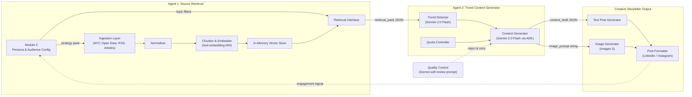

# System Architecture

## Full Pipeline



## Component Responsibilities

| Component | Owner | Responsibility |
|---|---|---|
| Module 0 | Dev 1 | Persona config, topic taxonomy, strategy pack |
| Ingestion Layer | Dev 1 | Pull NYC Open Data + article RSS feeds |
| Normalizer | Dev 1 | Clean text, deduplicate, extract metadata |
| Chunker & Embedder | Dev 1 | Split text into chunks, embed with Gemini |
| Vector Store | Dev 1 | In-memory cosine similarity search |
| Retrieval Interface | Dev 1 | Query top-k relevant chunks → JSON output |
| Trend Detector | Dev 2 | Identify trending angles from retrieved content |
| Content Generator | Dev 2 | Generate post draft using Gemini ADK agent |
| Quota Controller | Dev 2 | Limit output to N posts per run |
| Text Post Generator | Dev 2 | Format text for platform |
| Image Generator | Dev 2 | Generate image via Imagen 3 |
| Post Formatter | Dev 2 | Final multimodal post assembly |
| Quality Control | Dev 2 | Self-review prompt, retry if low quality |

## Google Cloud Services Used

| Service | Purpose |
|---|---|
| Gemini 2.0 Flash | Trend detection, content generation, QC |
| text-embedding-004 | Document and query embeddings |
| Imagen 3 | Post image generation |
| Google ADK | Agent orchestration |
| Cloud Run | Hosting the pipeline as a web service |
| Cloud Storage (optional) | Store generated posts and images |

## Agent Interface Contract

Agent 1 outputs a `retrieval_pack` JSON consumed by Agent 2:

```json
{
  "query_topic": "string",
  "persona": {
    "niche": "International students in NYC",
    "audience": "International students aged 18-30 in NYC",
    "tone": "helpful, empowering, informative",
    "content_goal": "surface inequities and share resources"
  },
  "results": [
    {
      "id": "uuid",
      "source_type": "nyc_open_data | article | event",
      "title": "string",
      "content_chunk": "string",
      "published_at": "ISO8601",
      "relevance_score": 0.0,
      "source_url": "string",
      "tags": ["string"]
    }
  ]
}
```

Agent 2 outputs a `content_draft` JSON consumed by the output layer:

```json
{
  "post_text": "string",
  "image_prompt": "string",
  "platform": "linkedin | instagram",
  "hashtags": ["string"],
  "sources": ["string"],
  "topic": "string"
}
```

## NYC Open Data Sources

| Dataset | Use Case | API Endpoint |
|---|---|---|
| CUNY Enrollment by Demographics | International student enrollment trends | `data.cityofnewyork.us` |
| NYC Rent Guidelines | Housing cost data for students | `data.cityofnewyork.us` |
| NYC Job Postings | Post-graduation job market | `data.cityofnewyork.us` |
| 311 Housing Complaints | Bad landlord warnings by area | `data.cityofnewyork.us` |
